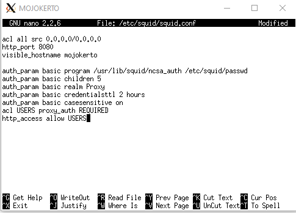

# Jarkom_Modul3_Lapres_D02

## Laporan Resmi Praktikum Modul 3 Jaringan Komputer 2020
**Kelompok D02**

-Calvin Wijaya 05111840000086

-Alie Husaini R. 05111840000097

##### 1. Membuat topologi jaringan

##### 2. Surabaya menjadi perantara (DHCP Relay) antara DHCP Server dan client.

##### 3. Client pada subnet 1 mendapatkan range IP dari 192.168.0.10 sampai 192.168.0.100 dan 192.168.0.110 sampai 192.168.0.200.

##### 4. Client pada subnet 3 mendapatkan range IP dari 192.168.1.50 sampai 192.168.1.70.

##### 5. Client mendapatkan DNS Malang dan DNS 202.46.129.2 dari DHCP

##### 6. Client di subnet 1 mendapatkan peminjaman alamat IP selama 5 menit, sedangkan client pada subnet 3 mendapatkan peminjaman IP selama 10 menit.

##### 7. User autentikasi milik Anri

##### 8. Membatasi penggunaan hanya pada setiap hari Selasa-Rabu pukul 13.00-18.00

##### 9. Membatasi penggunaan hanya pada setiap hari Selasa-Kamis pukul 21.00 - 09.00 keesokan harinya (sampai Jumat jam 09.00)

##### 10. Ketika mengakses google.com,di redirect menuju monta.if.its.ac.id

##### 11. Mengubah error page default squid

##### 12. Proxy cukup dengan mengetikkan domain janganlupa-ta.d02.pw dan memasukkan port 8080

